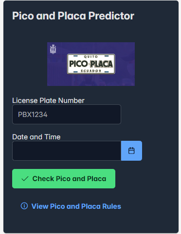

# Pico y Placa Predictor

## Overview

This project is a web-based **Pico y Placa Predictor** developed using **React** and **PrimeReact** components. The application helps users check if their vehicle can be on the road based on Ecuador's Pico y Placa restriction system, which limits road use depending on the last digit of the vehicle’s license plate, the day of the week, and the time of day.

### Features

- **License Plate Input**: The user can enter a vehicle license plate number (up to 7 characters).
- **Date and Time Selector**: The user can select a specific date and time.
- **Pico y Placa Verification**: Based on the selected date, time, and the last digit of the license plate, the application tells the user whether they are allowed to drive.
- **Pico y Placa Rules Display**: Users can view the rules for the Pico y Placa restrictions.

### Tech Stack

- **React**: Frontend library used to build the user interface.
- **PrimeReact**: UI component library for React used for interactive elements (like Calendar, Toast, InputText, etc.).
- **CSS (custom)**: Used for additional styling.
- **date-fns**: For date formatting.

## Project Setup

### Prerequisites

To run this project locally, ensure you have the following installed:

- Node.js (version 12.x or above)
- npm (version 6.x or above)
## Project Structure

- `src/`: Contains the main source code for the React app.
  - `components/`: Includes React components like `PicoPlacaForm`.
  - `services/`: Contains the `PicoPlacaService.js` file responsible for handling the business logic.
  - `assets/images/`: Holds the image assets used in the application.

### Key Components

1. **PicoPlacaForm**:
   - This component renders the form where users can enter their license plate number, select a date and time, and check whether their vehicle can drive.
   - The form also handles input validation, ensuring that the user provides a license plate number with a maximum of 7 characters and a valid date/time.
   - If any required fields are left empty, it displays an error message below the corresponding field.
   - Additionally, the form features a button that opens a dialog box with the rules for Pico y Placa restrictions.

2. **PicoPlacaService**:
   - This service is responsible for the logic that determines if a vehicle can drive.
   - It takes in the license plate number, date, and time as parameters and checks the restrictions based on the last digit of the license plate, the day of the week, and the time range.
   - The service returns a boolean value indicating whether or not the vehicle is allowed to be on the road.

## Usage

1. Enter your **license plate number** (up to 7 characters) in the input field.
2. Select the **date** and **time** using the calendar component.
3. Click the **"Check Pico and Placa"** button to find out if your vehicle can drive on the specified date and time.
4. If you're unsure about the rules, click the **"View Pico and Placa Rules"** button to open a dialog that explains the restrictions based on the last digit of your license plate.

## Screenshots

### Pico y Placa Form



### Installation

1. Clone the repository:
   ```bash
   git clone https://github.com/your-username/pico-y-placa-predictor.git
    

2. Navigate to the project directory:
   ```bash
   cd pico-y-placa-predictor

3. Install the dependencies:
   ```bash
   npm install

3. Run the Project
After installation, you can start the development server using:
   ```bash
   npm start

